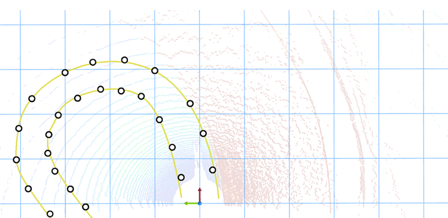

# `lidar_cluster` ROS 2 package
LIDAR pointcloud clustering in `ROS 2` `Humble`

[](https://docs.ros.org/en/humble/)

<center>
 
</center>

## Build this `ROS 2` package

In the following `~/ros2_ws` is assumed as the ROS 2 workspace:

``` bash
cd ~/ros2_ws/src
```

``` bash
git clone https://github.com/jkk-research/lidar_cluster_ros2
```

``` bash
cd ~/ros2_ws
```

Build either with:

``` bash
colcon build --packages-select lidar_cluster --symlink-install
```

or with optimized build:

``` bash
MAKEFLAGS="-j4" colcon build --packages-select lidar_cluster --symlink-install --cmake-args -DCMAKE_BUILD_TYPE=Release
```

> [!TIP]
> There is a detailded decription how to make this package work with ground segmentation: [jkk-research.github.io/workshops/clustering_a](https://jkk-research.github.io/workshops/clustering_a/)

## ROS 2 graph


## Cluster nodes

| Node | Clustering | Implementation | Description | Additional Resources |
| --- | --- | --- | --- | --- |
| `dbscan_spatial` | DBSCAN | spatial| DBSCAN non-grid implementation | |
| `dbscan_grid` | DBSAN | grid | DBSCAN voxel-grid-based implementation | |
| `dblane_spatial` | DBlane | spatial| DBlane non-grid implementation | [flowchart](https://github.com/jkk-research/lidar_cluster_ros2/blob/ros2/notebooks/flowchart.md), [notebooks](https://github.com/jkk-research/lidar_cluster_ros2/tree/ros2/notebooks) |
| `dblane_f1s` | DBlane | formula | DBlane formula 1 student implementation | [notebooks](https://github.com/jkk-research/lidar_cluster_ros2/tree/ros2/notebooks) |
| `euclidean_spatial` | Euclidean | spatial| PCL implementation of Euclidean clustering non-grid implementation | [PCL docs](https://pointclouds.org/documentation/group__segmentation.html) |
| `euclidean_grid` | Euclidean | grid| PCL implementation of Euclidean clustering voxel-grid-based implementation | [PCL docs](https://pointclouds.org/documentation/group__segmentation.html) |


<details>
<summary> Don't forget to source before ROS commands.</summary>

``` bash
source ~/ros2_ws/install/setup.bash
```
</details>

``` bash
ros2 run lidar_cluster dblane_spatial
```

``` bash
ros2 launch lidar_cluster dblane_spatial.launch.py
```

``` bash
ros2 launch lidar_cluster dblane_f1s.launch.py topic:=/input_points
```

## Remarks

In VS code it is advised to add the following to include path:

``` r
${workspaceFolder}/**
/opt/ros/humble/include/**
/usr/include/pcl-1.12/**
/usr/include/eigen3/**
```

If you are not sure where your header files are use e.g.:
``` r
find /usr/include -name point_cloud.h
find /usr/include -name crop_box.h
```

## Images

> [!NOTE]  
> The following images shows two possible usage of clustering: an urban scenario and a race scenario.
> The first row shows a camera image that corresponds to the LIDAR image in the second row. In the third row an example is shown of the clustered LIDAR pointcloud with yellow.


| Urban scenario | Race scenario |
|:---:|:---:|
 |  
 | 
 |  


# Citation

If you use any of this code please consider citing the [paper](https://ieeexplore.ieee.org/document/10607072):

``` bibtex
@INPROCEEDINGS{10607072,
  author={Unger, Miklós and Horváth, Ernő and Pup, Dániel and Pozna, Claudiu Radu},
  booktitle={2024 IEEE International Conference on Mobility, Operations, Services and Technologies (MOST)}, 
  title={Towards Robust LIDAR Lane Clustering for Autonomous Vehicle Perception in ROS 2}, 
  year={2024},
  pages={229-234},
  keywords={Laser radar;Lane detection;Source coding;Clustering algorithms;Robustness;Pattern recognition;Autonomous vehicles;self-driving;autonomous;point cloud;LIDAR;proceeding;filter;geometric patterns},
  doi={10.1109/MOST60774.2024.00031}}
```